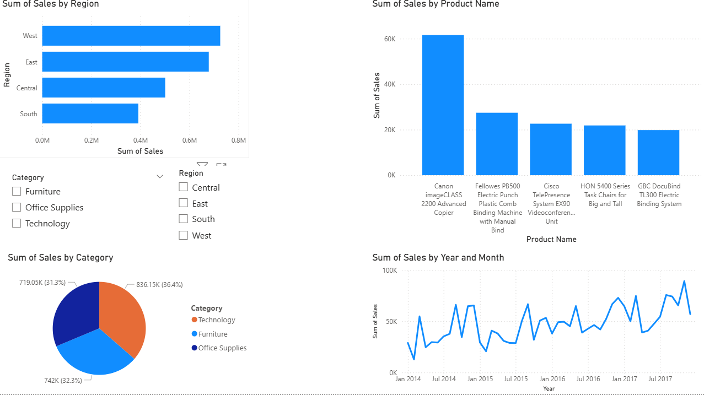

# Sales Data Analysis using SQL

## Tools Used
- SQL

## Objective
To analyze sales data and extract meaningful business insights.

## Dataset
- ~5,000+ rows of sales data
- Includes region, category, product, and sales metrics

## Key Insights
- The West region generates the highest sales.
- The Technology category contributes the most revenue.
- A small number of products dominate overall sales.
- Some products consistently perform poorly in sales.
- Standard Class is the most commonly used shipping method.

 ## Business Impact

- Helped identify high-performing segments to improve revenue strategy
- Highlighted inefficient areas to optimize cost and marketing spend

## Conclusion
Data analysis helps identify high-performing areas and optimize low-performing products to improve business performance.
Identified top 20% of products contributing to majority of revenue (Pareto pattern)

## Dashboard Preview

